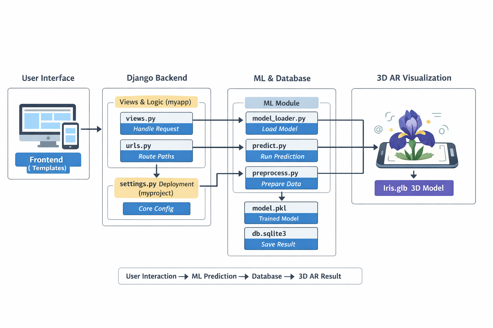

# 🌸 Iris Flower Predictor & AR Explorer

A full-stack Django application that combines **Machine Learning** with **Web-based Augmented Reality**. Users can predict the species of an Iris flower based on physical measurements and immediately visualize the result using a 3D Prism in AR.




## 🚀 Features

| Category | Feature | Description |
| :--- | :--- | :--- |
| **Machine Learning** | Random Forest Classifier | Predicts Setosa, Versicolor, or Virginica using Scikit-Learn. |
| **Database** | Prediction History | Saves every prediction to SQLite with timestamps and input data. |
| **AR System** | Marker-based AR | Uses **AR.js** and the **Hiro Marker** for laptop/webcam visualization. |
| **AR System** | Mobile WebXR | Uses **Google Model-Viewer** for native AR on Android/iOS. |
| **3D Interaction** | Professional Controls | Pinch-to-zoom, inertia-based rotation, and auto-centering. |
| **Dynamic Mapping** | Axis-to-Species | Automatically rotates the 3D Prism to the correct face based on the ML result. |

---

## 📂 Project Structure

```text
iris_master_project/
├── manage.py              # Django CLI
├── train_model.py         # Script to generate model.pkl
├── myapp/                 # Main Application Logic
│   ├── ml/                # Machine Learning Pipeline
│   │   ├── model_loader.py
│   │   ├── predict.py
│   │   └── preprocess.py
│   ├── model/             # Saved ML Model
│   │   └── model.pkl
│   ├── static/            # 3D Assets
│   │   └── models/
│   │       └── Iris.glb
│   ├── models.py          # Database Schema
│   ├── views.py           # ML & AR Routing Logic
│   └── urls.py            # App-level Routes
├── templates/             # UI Layer
│   ├── index.html         # ML Dashboard + Integrated AR
│   └── laptop_ar.html     # Dedicated Webcam AR Page
└── iris_project/          # Project Configuration
    ├── settings.py
    └── urls.py
```

---

## 🛠️ Installation & Setup

### 1. Clone & Environment
```bash
git clone <your-repo-url>
cd iris_master_project
python -m venv env
source env/bin/activate  # Windows: .\env\Scripts\activate
pip install django scikit-learn joblib pandas numpy
```

### 2. Train the Model
Ensure you have the `model.pkl` generated before starting the server:
```bash
python train_model.py
```

### 3. Database Migration
```bash
python manage.py makemigrations
python manage.py migrate
```

### 4. Run the Server
```bash
python manage.py runserver
```

---

## 🧪 How It Works

### The ML-AR Bridge
1. **Input:** User enters Sepal/Petal dimensions in `index.html`.
2. **Prediction:** `predict.py` uses the Random Forest model to return a species name.
3. **Storage:** The result is saved to the `IrisPrediction` model in the database.
4. **Mapping:** - **Mobile:** `index.html` uses JavaScript to update the `camera-orbit` of the `<model-viewer>`.
   - **Laptop:** `laptop_ar.html` uses Django template tags to set the `rotation` of the `prism-wrapper` to the specific axis face:
     - **Setosa:** Y-Axis (0°)
     - **Virginica:** -X Axis (90°)
     - **Versicolor:** X Axis (-90°)

---

## 📱 Mobile AR Testing
Because WebXR (AR via browser) requires a secure connection, follow these steps for mobile testing:
1. Install [ngrok](https://ngrok.com/).
2. Run your Django server.
3. In a new terminal, run: `ngrok http 8000`.
4. Open the **HTTPS** link provided by ngrok on your Android/iOS device.

---

## 📜 License
This project is built for educational purposes combining Django, Scikit-Learn, and A-Frame.

---


# 📁 **Simple Directory Structure**

```
myproject/
│
├── manage.py
├── db.sqlite3
├── train_model.py
├── model/
│   └── model.pkl
├── code/
│   └── setup.txt
│
├── myproject/          # Main Django project
│   ├── settings.py
│   ├── urls.py
│   ├── asgi.py
│   └── wsgi.py
│
├── myapp/              # Main app
│   ├── views.py
│   ├── models.py
│   ├── urls.py
│   ├── admin.py
│   │
│   ├── ml/             # ML logic
│   │   ├── model_loader.py
│   │   ├── predict.py
│   │   └── preprocess.py
│   │
│   └── migrations/
│
├── static/
│   └── models/
│       └── Iris.glb    # 3D model
│
├── templates/
│   ├── index.html
│   ├── *_index.html
│   └── *_ar.html
│
└── tests.py
```

---

# ⚡ **Super Simple Understanding**

* **Django Core →** `myproject/`
* **Main App →** `myapp/`
* **ML Logic →** `myapp/ml/`
* **Frontend →** `templates/`
* **3D AR Model →** `static/models/`
* **Database →** `db.sqlite3`
* **Model →** `model.pkl`

---

# 🚀 **One-Line Idea**

👉 Django app + ML model + AR visualization in one project

---


